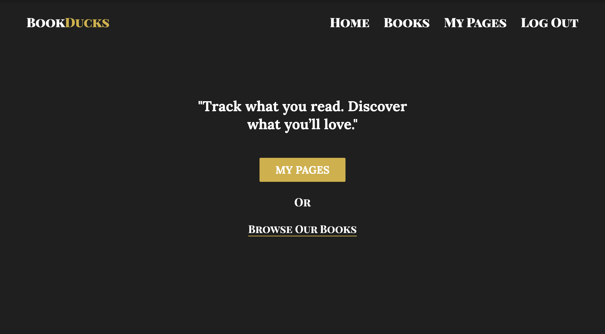
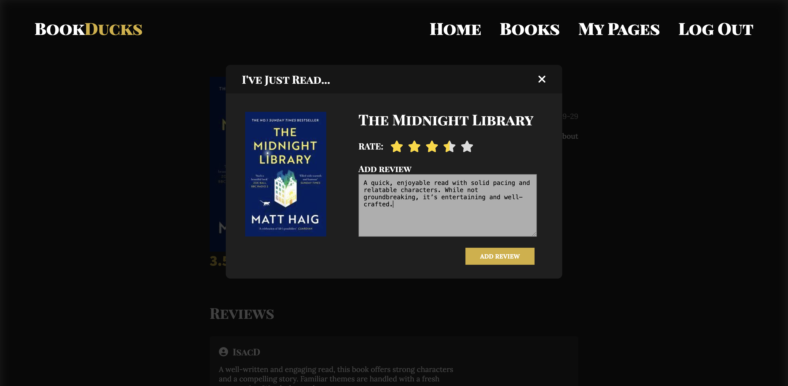
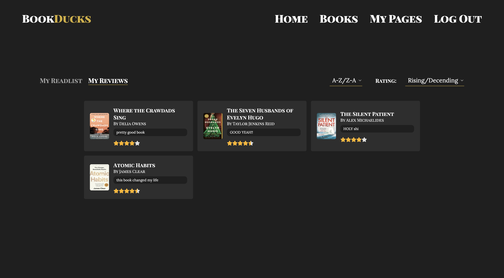

# 🌐 BookDucks: Browse, review and rate books.

Welcome to my personal web project built with [Strapi](https://strapi.io/) – a powerful headless CMS.

## ✨ Preview

Here's what the site looks like:


### 📚 Browse Books


### 📖 Landing Page


### 🔐 Login


### 📘 Book Detail Page


### 📝 Submit a Review


### 📄 Read List


### ⭐ All Reviews


### 🙋‍♂️ My Pages


---

## 🚀 Getting Started

To get this project running on your local machine, follow these simple steps:

### Prerequisites

- **Node.js** (v18 or later recommended)
- **npm** or **yarn**
- **SQLite** (comes by default with Strapi, or you can configure PostgreSQL/MySQL)

### 📦 Installation

```bash
# Clone the repo
git clone https://github.com/your-username/your-project-name.git

# Navigate into the project directory
cd your-project-name

# Install dependencies
npm install
# or
yarn install

cd backend

npm run dev

